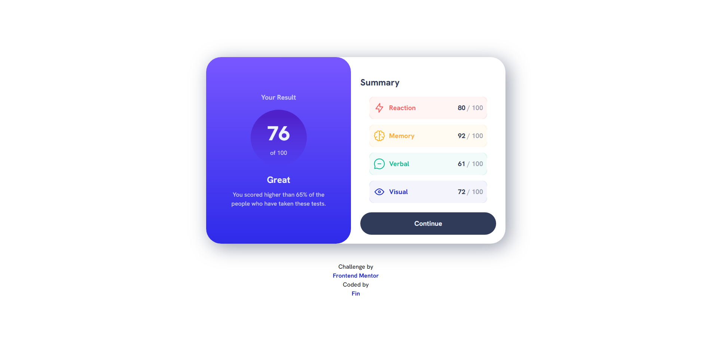
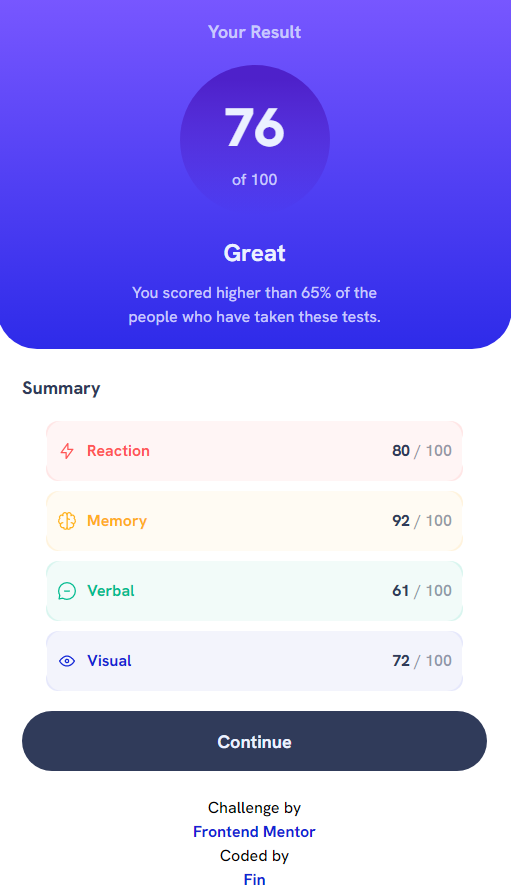

# Frontend Mentor - Results summary component solution

This is a solution to the [Results summary component challenge on Frontend Mentor](https://www.frontendmentor.io/challenges/results-summary-component-CE_K6s0maV).

## Table of contents

- [Overview](#overview)
  - [Screenshots](#screenshots)
  - [Links](#links)
- [My process](#my-process)
  - [Built with](#built-with)
  - [What I learned](#what-i-learned)
  - [Continued development](#continued-development)
  - [Useful resources](#useful-resources)
- [Author](#author)

## Overview

### Screenshots




### Links

- Solution URL: [Add solution URL here](https://github.com/tdtatum2/Results-Summary)
- Live Site URL: [Add live site URL here](https://tdtatum2.github.io/Results-Summary)

## My process

### Built with

- Semantic HTML5 markup
- CSS custom properties
- Flexbox
- Mobile-first workflow
- [React](https://reactjs.org/) - JS library

### What I learned

This challenge really pushed my skills as a developer, which was a lot of fun. It reminded me that even though a proejct may look simple, the specifics will always end up taking more time than expected. Below are a few cool tricks and issues I ran into:

```scss
.summary-category {
  position: relative;
  display: flex;
  width: 100%;
  margin-bottom: 10px;
  padding: 0 10px;
  opacity: 1;
  height: 60px;
  border-radius: 15px;
  &::before, &::after {
    content: "";
    position: absolute;
    left: -1px;
    width: calc(100% + 2px);
    height: 40%;
    border-radius: 15px;
    z-index: -1;
  }

  &::before {
    top: 0;
  }

  &::after {
    bottom: 0;
  }

  @media screen and (min-width: 768px) {
    font-size: 18px;
    margin-bottom: 15px;
    img {
      width: 32px;
    }
  }
}
```

1. The power of SCSS. Being able to nest child elements inside of the parent element (and include media queries) is so useful and makes the styling code look much cleaner. It also helps to review code when issues come up because you know exactly where elements will differ by screen size.

```scss
.category-title {
  flex: 1;
  align-self: center;
  justify-self: flex-start;
  display: flex;
  align-items: center;
}
.summary-category p {
  flex: 1;
  text-align: right;
  align-self: center;
  justify-self: flex-end;
  font-weight: 700;
  color: hsla(224, 30%, 27%, 0.5);
}
```

2. The inclusion of "flex: 1;" to utilize align-self and justify-self in child elements.


```scss
.reaction-category {
  background-color:rgb(255, 245, 245);
  &::before, &::after{
    background-color: hsla(0, 100%, 67%, 0.15);
  }
}
```

3. The implementation of the darker corners on the background where the category scores appear took me a lot of time. Through that hardship, I also learned about converting hsla values to rgb values based on what colour the background they're on top of is!

### Continued development

- I want to continue to sharpen my skills in creating responsive designs.
- I want to learn more flexbox skills.
- I want to experiment with using miniscule details to add depth and meaning to designs in my own projects, like the tiny darkened corners of the summary categories.

### Useful resources

- [My Custom CSS Reset](https://www.joshwcomeau.com/css/custom-css-reset/) - A useful CSS Reset template by Josh W Comeau recommended to me by Kamlesh Rajesh Yadav in a comment on my first ever Frontend Mentor post!
- [Alpha Composing — Stack Overflow](https://stackoverflow.com/questions/2049230/convert-rgba-color-to-rgb) - Andras Zoltan has a beautiful response that perfectly explains tha algorithm used to convert from RGBA to RGB based on background colour. This came in handy after converting from HSLA to RGBA.


## Author

- Website - [Fin](https://www.fintatum.com)
- Frontend Mentor - [@tdtatum2](https://www.frontendmentor.io/profile/tdtatum2)